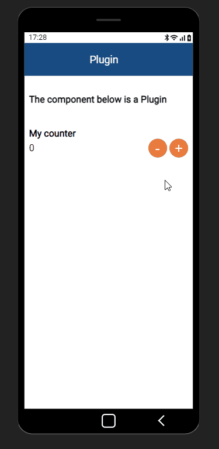

# Zyllio Plugin VueJS : Counter

This Zyllio plugin is a Conter Component implemented using [VueJS](https://v3.vuejs.org/)

# Demonstration



# Development environment

To build this plugin, Node.js 14+ is required

# Experiment

Install this pre-built file to experiment the plugin:
```
https://zyllio.github.io/zyllio-plugin-vuejs/dist/js/app.js
```

# Build

```shell
npm install

npm run build
```

# Install

Once built, only app.js file is to be installed within Zyllio Studio under Designer/Plugins panel

# Fork this plugin

You are welcome to clone and fork this repository, looking forward your creativity 😀

# Support

Zyllio team is available for any support, feature requests and questions

- email: contact@zyllio.com
- twitter: [@zyllio](https://twitter.com/zyllio)